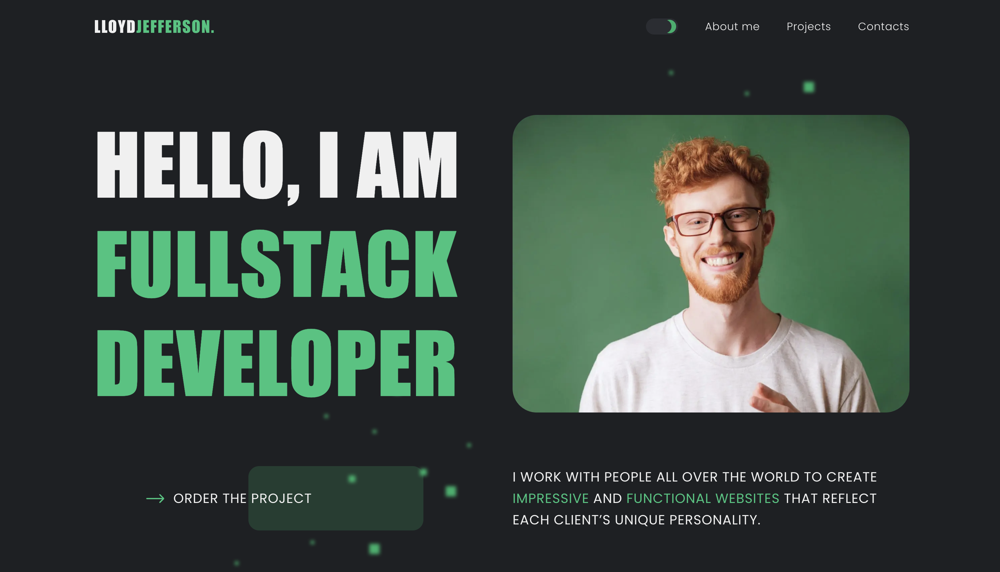

# Особистий сайт розробника Ллойда Джефферсона

Цей репозиторій містить результат нашої спільної роботи над командним проєктом у рамках навчання в [GoIT Academy](https://goit.global/ua/). Ми створили професійний персональний вебсайт для вигаданого талановитого фулстек-розробника Ллойда Джефферсона.

# Про проєкт

У сучасному світі цифрова присутність стає важливою складовою професійної діяльності. Нам, студентам GoIT, було поставлено унікальне завдання – розробити повноцінний персональний сайт "з нуля". Цей проєкт дозволив нам не лише застосувати здобуті знання, але й попрацювати в команді, що нагадувало реальні умови роботи в IT-компанії.

Ми підійшли до проєкту творчо, створивши сайт для вигаданого персонажа Ллойда Джефферсона – досвідченого фулстек-розробника. Це дало нам свободу у дизайні та змісті, водночас зберігаючи фокус на найкращих практиках веброзробки.

# Освітні цілі

1. **Застосування фронтенд-технологій**: Від верстки до інтеграції на сервер.
2. **Робота в команді**: Розподіл ролей, спілкування, керування Git.
3. **Управління проєктом**: Планування, визначення пріоритетів завдань.
4. **Розв'язання проблем**: Спільний пошук рішень технічних викликів.

# Основні розділи сайту

- **Header**: Навігація сайтом та налаштування теми.
- **Home Page**: Привітання та заклик до дії.
- **About Lloyd**: Біографія, освіта та технічні навички.
- **Projects**: Галерея портфоліо з описами.
- **Benefits**: Чому варто працювати з Ллойдом.
- **FAQ**: Відповіді на популярні запитання.
- **Testimonials**: Рекомендації клієнтів.
- **Contact**: Форма зворотного зв'язку та контактна інформація.
- **Footer**: Швидкі посилання, соцмережі та авторські права.

# Внесок команди

Цей проєкт є результатом спільних зусиль нашої талановитої команди:

- **Team Lead**: [Daniil Belik](https://github.com/daniilbelik94) | Section: Work together;
- **Scrum Master**: [Olga Riabuha](https://github.com/Olya-rar) | Section: My Projects;
- **Front-End Developer**: [Roman Belyaev]( https://github.com/Plane-Jumper5) | Section: Header ;
- **Front-End Developer**: [Tetiana Korkh](https://github.com/Tetiana1104) | Section: Hero;
- **Front-End Developer**: [Vlad Zhelevskyi](https://github.com/vladjelevsky) | Section: Benefits;
- **Front-End Developer**: [Svitlana Fedorova](https://github.com/lana150) | Section: About Me;
- **Front-End Developer**: [Sveta Palyh](https://github.com/Svetakler) | Section: Tech Skills;
- **Front-End Developer**: [Oleksandra Voronkina](https://github.com/Alexandra0707) | Section: FAQ;
- **Front-End Developer**: [Anzhelika Kondakova](https://github.com/anzheliketta) | Section: Reviews;
- **Front-End Developer**: [Bohdana Skolzaieva](https://github.com/Bohdana-Skolzaieva-3101) | Section: Footer;
- **Front-End Developer**: [Vlad Kiriluk](https://github.com/ender179) | Section: Scroll-up;

# Технологічний стек
Фронтенд: HTML, CSS, JavaScript;
Додатково: GSAP, Axios, SwiperJS, Accordion-js, izitoast;
Збірка: Vite.

# Наш досвід у GoIT

Цей проєкт став важливим кроком на нашому шляху в [GoIT](https://goit.global/ua/). Він допоміг не лише закріпити технічні навички, але й відчути реалії роботи над вебпроєктами:

Робота з дедлайнами: Ми навчилися ефективно розподіляти час, виконуючи завдання вчасно.
Рев'ю коду: Регулярно переглядали код один одного, покращуючи його якість через конструктивний зворотний зв'язок.
Презентація проєкту: Навчилися демонструвати свою роботу наставникам і пояснювати прийняті рішення.
Зворотний зв'язок клієнта: Адаптувалися до побажань "клієнта" (викладачів), що нагадувало реальні взаємодії з замовниками.
Подальші плани
Завершення цього проєкту дало нам не лише неоціненний досвід роботи в команді, а й потужний елемент портфоліо. Сайт Ллойда Джефферсона, хоч і для вигаданого персонажа, є реальним доказом нашої здатності створювати професійні вебрішення.